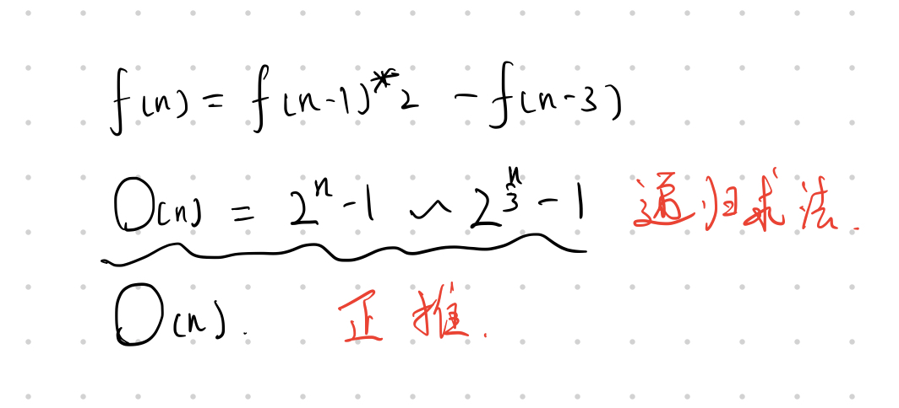

## English Course Task
#### English Course Task

[URL](https://www.jlu.edu.cn)

[readme1](./README1.md)




```c++
std::cout << "Hello World" << std::endl;
```


> Do one thing at a time, and do well

* content 1
* content 2

1. list 1
2. list 2


| name1 | name2 |
| ------ | ------- |
| number1 | content1 |
| number2 | content2 |


**bold text** 

*italic text* 

---
~~strikethrough~~
___

